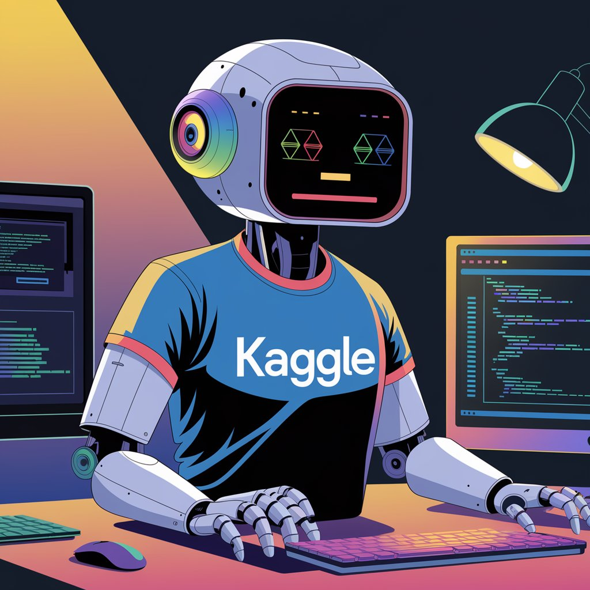

# Kaggle Competition Assistant

<div align="center">
   
</div>

Small toy utility to help with Kaggle competition onboarding.   
Intended to simplify diving into the new competition information and keeping up to date with discussions and comments.

Current functionality is limited to simple questions about the competition & discussion forum info.   
Internally built as RAG tool (retrieval augmented generation).

**Main current use cases:**
1. high-level competition overview
2. learn about topics in the discussion forum
3. leaderboard info
4. text interaction: quick & easy way to get information without sifting through many pages of competition

### Demo
[Video demo](media/demo.mp4)

## Setup & dependencies
1. Python 3.11
2. Docker
3. RAM available for Docker: ~9GB 
4. Create API keys and put them in the `.env` file (see `.env_example`)
   - kaggle api key: [how to create](https://github.com/Kaggle/kaggle-api/blob/main/docs/README.md#api-credentials)
   - gemini api key (no credit card required, free quota for >1k `gemini-1.5-flash` requests per day): [how to create](https://ai.google.dev/gemini-api/docs/quickstart?lang=python)

## Run the assistant
1. Dockerized implementation

    Streamlit UI assistant with hybrid retrieval (via OpenSearch), monitoring and feedback collection (via PostgreSQL and Grafana).
   1. `make up` (or `docker compose --env-file .env up`)
   2. Wait until all services are ready (takes ~10 mins)
   3. Open [localhost:8501](http://localhost:8501) to view streamlit UI
   4. Open the `kaggle-assistant` dashboard from the Grafana UI [localhost:3000/dashboards](http://localhost:3000/dashboards) to view monitoring dashboard
      - grafana credentials: login - `admin`, password - `admin` (keep unchanged when prompted)
   5. To shut down the application run `make down` (or `docker compose down`)
2. Core standalone python library

    It's also possible to run the core logic of the assistant just as a python library.

    For the retrieval instead of hybrid retrival via OpenSearch a simple lexical search in-memory implementation will be used.   

    No monitoring and feedback collection.

    See example in [`full_example_simple.py`](examples/full_example_simple.py)


## Data scraping
The repository contains scrapped data for 3 competitions (snapshots Sep 15/30, 2024) in [`data`](data) directory:
- [`Rohlik Orders Forecasting Challenge`](https://www.kaggle.com/competitions/rohlik-orders-forecasting-challenge/)
- [`Arc Prize 2024`](https://www.kaggle.com/competitions/arc-prize-2024)
- [`LLM Zoomcamp 2024 competition`](https://www.kaggle.com/competitions/llm-zoomcamp-2024-competition)

To scrape a new version / new competition, use the utility function from the library:
```python
from kaggle_competition_assistant import scrape_competition_data

competition_slug = 'arc-prize-2024'
scrape_competition_data(competition_slug=competition_slug, path='data')
```
After calling this function the scrapped data will be saved into `data/arc-prize-2024` directory
and will be ready for ingestion by the assistant.

Depending on the number of pages in the discussion forum scrapping can take some time (~1 hour for arc-prize-2024).   
Scraping speed is limited by Kaggle rate limits.

Currently, the following information is scrapped:
1. Competition overview
2. Dataset information
3. Leaderboard
4. Discussion forum


## Project structure
Key folders and files:
- [`data`](data) - scrapped data + evaluation data & results
- [`kaggle_competition_assistant`](kaggle_competition_assistant) - core python library that contains the assistant (scraping utilities & RAG creation)
   - [`scrape`](kaggle_competition_assistant/scrape) - scraping logic scripts
   - [`index/minsearch.py`](kaggle_competition_assistant/index/minsearch.py) - simple in-memory lexical search engine
   - [`index/opensearch_index.py`](kaggle_competition_assistant/index/opensearch_index.py) - implementation of various retrieval modes via OpenSearch
   - [`llm.py`](kaggle_competition_assistant/llm.py) - LLM utilities
   - [`assistant.py`](kaggle_competition_assistant/assistant.py) - top-level API & logic (ingestion + RAG creation)
- [`app`](app) - streamlit demo app to chat with assistant and provide feedback
  - [`app.py`](app/app.py) - streamlit UI & voice support
  - [`assistants.py`](app/assistant.py) - assistants query & relevance evaluation
  - [`db.py`](app/db.py) - logic for logging requests and responses to postgres / monitoring
  - [`storage_init.py`](app/storage_init.py) - script for initializing the database & assistants creation
  - [`install_tts.sh`](app/install_tts.sh) - script to install text to speech dependencies
- [`monitoring`](monitoring) - monitoring dashboard
  - [`dashboard.json`](monitoring/dashboard.json) - configurations of dashboard to load by grafana
  - [`init_dashboard.py`](monitoring/init_dashboard.py) - script to initialize dashboard from [`dashboard.json`](monitoring/dashboard.json)

## Technologies & techniques used
1. Knowledge base creation
   - web scrapping: [selenium](https://selenium-python.readthedocs.io), [tenacity](https://github.com/jd/tenacity)
   - api access: [kaggle api](https://github.com/Kaggle/kaggle-api)
2. Retrieval
   - data preprocessing & chunking: [langchain](https://github.com/langchain-ai/langchain)
   - lexical & semantic search: [OpenSearch](https://github.com/opensearch-project/opensearch-py)
   - document embeddings for semantic search: [`sentence-transformers/multi-qa-mpnet-base-cos-v1`](https://huggingface.co/sentence-transformers/multi-qa-mpnet-base-cos-v1)
   - reranking: custom implementation of [Reciprocal rank fusion (RRF)](https://www.elastic.co/guide/en/elasticsearch/reference/current/rrf.html) algorithm
   - query rewriting: generating rewritten variations of original user question (using LLM) to 
   retrieve additional context from index and potentially improve RAG results
3. Text generation
   - LLM models for generation: `gemini-1.5-flash-latest`/`gemini-1.5-pro-latest` (free tier via [Google AI Studio](https://aistudio.google.com))
4. Voice input (speech-to-text)
    - [`faster-whisper`](https://github.com/SYSTRAN/faster-whisper)
5. Voice output (text-to-speech)
    - [`MeloTTS`](https://github.com/myshell-ai/MeloTTS/)
6. Interface
   - Demo UI: [streamlit](https://github.com/streamlit/streamlit)
7. Feedback collection & monitoring
   - PostgreSQL: [PostgreSQL](https://www.postgresql.org/)
   - Grafana: [Grafana](https://grafana.com/)
8. Containerization
    - Docker: [Docker](https://www.docker.com/)


## Documentation
1. [Evaluation](docs/evaluation.md)
2. [Monitoring](docs/monitoring.md)
3. [Voice support](docs/voice_support.md)


## Project self-evaluation
See self-evaluation with some supplemental comments in [project_self_evaluation.md](docs/project_self_evaluation.md)


## TODOs
See potential future improvements in [TODO.md](docs/TODO.md)
